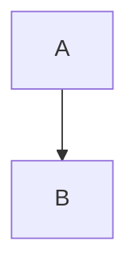

# Lint

Espaço no fim da linha.   
Tabulação	aqui.

Duas linhas em branco acima.
## Título sem linha em branco antes
Título termina com pontuação abaixo.

## Título com ponto.

Matemática que não deve gerar diagnóstico: $a  b$ e

$$
x   =   1   
$$

Calc =2+3   

HTML em linha (MD033 desligado no padrão)

Linha muito longa que passaria de oitenta caracteres se o MD013 estivesse ligado no padrão do lint.
