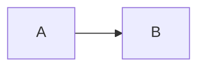
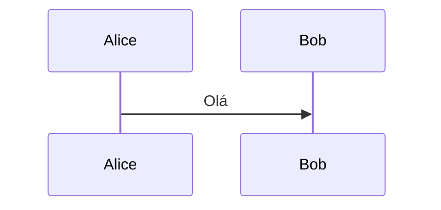
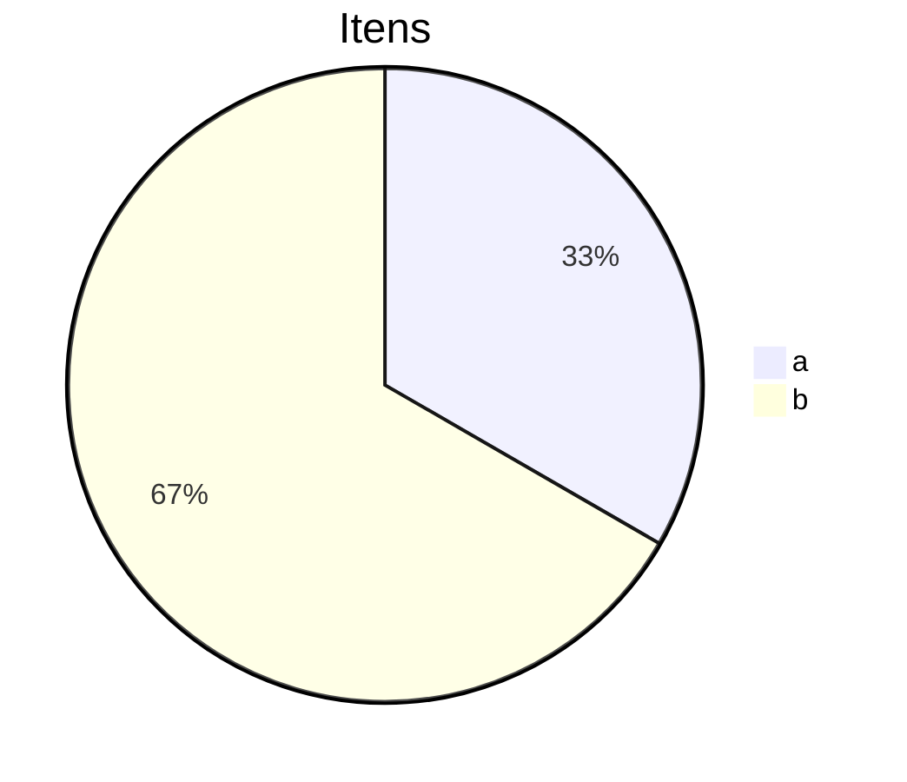

# Exportação

Texto com **negrito**, *itálico* e um [link seguro](https://example.com).

Um link perigoso: [clique](javascript:alert(1)).

<b onclick="alert(1)">HTML cru que deve aparecer como texto</b>

Fórmulas: $a^2$, $b_1$, $\alpha$, $\beta$, $\gamma$, $\sqrt{2}$, $\frac{1}{3}$, $x+y$, $e^{i\pi}$, $\sum_i i$,
$\prod_j j$, $\log x$, $\sin x$, $\cos x$, $\tan x$, $\lim_{n} n$, $\infty$, $\pi r^2$.

$$
E = mc^2
$$

$$
\nabla \cdot \vec{E} = \frac{\rho}{\varepsilon_0}
$$

| A | B |
| --- | --- |
| 1 | 2 |

| C | D | E |
| :-- | :-: | --: |
| x | y | z |

| F |
| --- |
| só uma coluna |

Cálculos: =1+1 =2+2 =3*3 =10/2 =2^8 =9%4 =-1+3 =0.1+0.2 =(1+2)*3 =1/0
