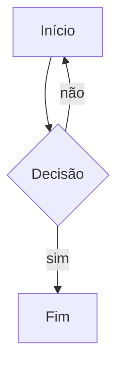

# Documento rico

Um diagrama:

Uma tabela GFM:

| Item | Valor |
| --- | ---: |
| a | 1 |
| b | 2 |

Fórmula em linha $x^2 + y^2 = z^2$ e um bloco:

$$
\int_0^1 x\,dx = \frac{1}{2}
$$

Resultado do cálculo: =2+3

Fim.
